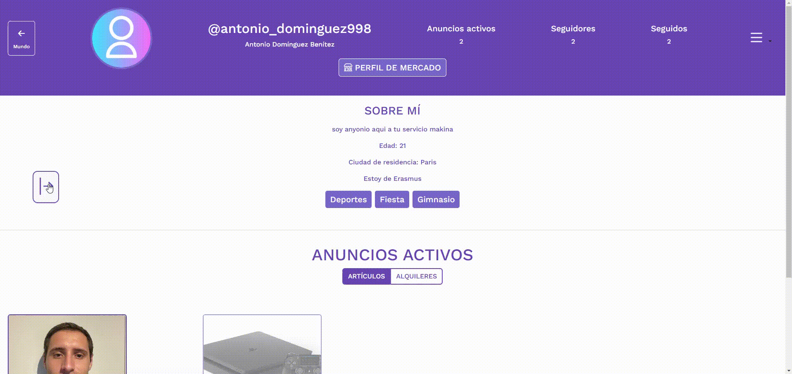
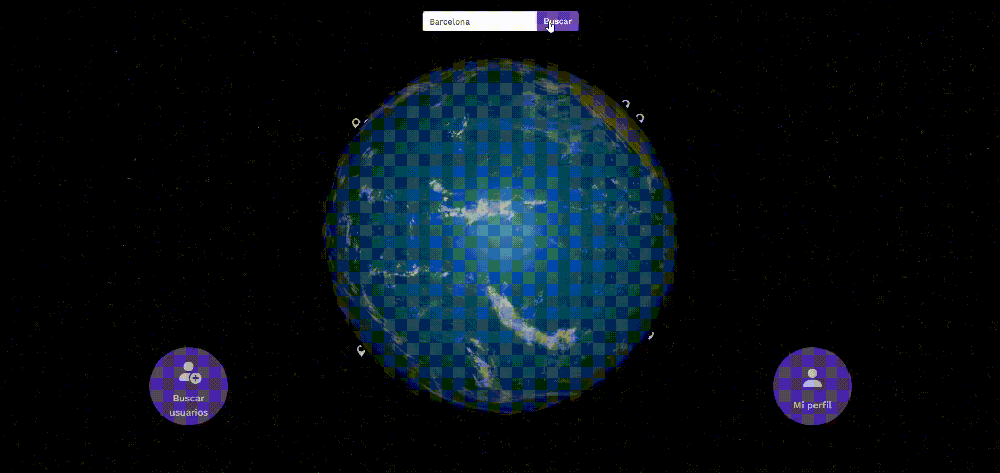
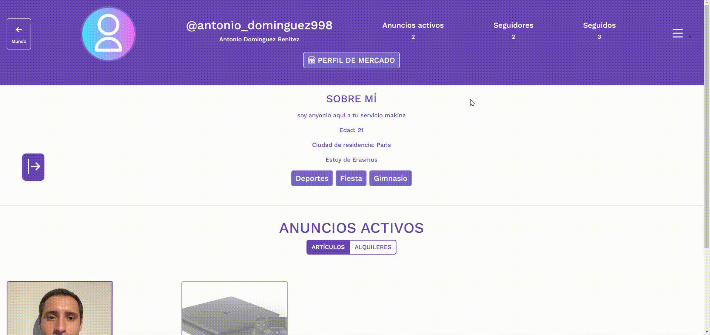

# Worldin - La Red Social para Estudiantes Erasmus+

## ✨ Sobre el Proyecto
Durante el curso 2022/2023, realicé una beca Erasmus+ en Budapest, Hungría, donde observé carencias tecnológicas en aspectos cotidianos como:
- Encontrar actividades nocturnas y eventos sociales.
- Falta de conocimiento de otras ciudades a visitar.
- Coordinar encuentros entre estudiantes Erasmus.
- Comprar, vender o ceder objetos de segunda mano.

Estas experiencias me llevaron a conceptualizar **Worldin**, una red social innovadora para estudiantes Erasmus+, diseñada tras un análisis de mercado y competidores.

## 🌍 Características Principales
Worldin integra múltiples funcionalidades para cubrir las necesidades de los usuarios:

### 🔮 Mapa 3D Interactivo
Un globo terráqueo 3D con marcadores en ciudades Erasmus+. Permite a los usuarios encontrar información relevante sobre cada destino.


### 🛍️ Mercado Local
Los estudiantes pueden comprar y vender productos o buscar alojamiento en su ciudad Erasmus.


### 🗓️ Calendario de Eventos
Una agenda de eventos sociales y deportivos en cada ciudad, permitiendo a los usuarios organizar y unirse a actividades.



### 🤝 Comunidad Local
Chats grupales y privados para conectar con otros estudiantes Erasmus+ en la misma ciudad o en otras partes del mundo.



### 🌍 Mapa Turístico
Puntos de interés destacados en cada ciudad para planificar visitas turísticas.


### 👤 Perfiles Personalizados
Cada usuario tiene un perfil donde puede compartir información sobre sí mismo, sus intereses y sus viajes.



## 📚 Tecnologías Utilizadas
Worldin ha sido desarrollado con:
- **Backend:** Django (Python)
- **Frontend:** HTML, CSS, Bootstrap, JavaScript
- **Metodología de desarrollo:** Scrum
- **Gestor de tareas:** Clockify y tableros Kanban de GitHub

## ⚙ Instalación y Ejecución
1. Clonar el repositorio:
   ```bash
   git clone https://github.com/usuario/worldin.git
   cd worldin
   ```
2. Crear y activar un entorno virtual:
   ```bash
   python -m venv venv
   source venv/bin/activate  # En Windows: venv\Scripts\activate
   ```
3. Instalar dependencias:
   ```bash
   pip install -r requirements.txt
   ```
4. Aplicar migraciones y ejecutar el servidor:
   ```bash
   python manage.py migrate
   python manage.py runserver
   ```

## 💬 Contribuir
Si quieres contribuir a Worldin, puedes enviar un email a noreply.confirmation.worldin@gmail.com

---
**Worldin** - Conectando estudiantes Erasmus+ en todo el mundo. 🌐

